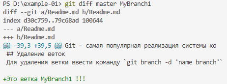

# Инструкция для работы с Git

## Что такое Git

Git – самая популярная реализация системы контроля версий, имеющая локальные и удалённые репозитории.

## Подготовка репозитория

Для создания репозитория надо выполнить команду `git init` в папке с репозиторием 
(в результате в этой папке появится скрытая папка `.git`).

## Создание коммитов

### Git add
Для добавления измений в коммит используется команда `git add`. Чтобы использовать команду `git add` напишите `git add <имя файла>`

### Просмотр состояния репозитория
Для того, чтобы посмотреть состояние репозитория используется команда `git status`. Для этого необходимо в папке с репозиторием написать `git status`, и Вы увидите были ли измения в файлах, или их не было.

### Создание коммитов
Для того, чтобы создать коммит(сохранение) необходимо выполнить команду `git commit`. Выполняется она так: `*`git commit -m "<сообщение к коммиту>`*`. Все файлы для коммита должны быть ***ДОБАВЛЕНЫ*** и сообщение к коммиту писать ***ОБЯЗАТЕЛЬНО***.

## Перемещение между сохранениями
Для того, чтобы перемещаться между коммитами, используется команда `git checkout`. Используется она в папке с пепозиторием следующим образом: `git checkout <номер коммита>`

## Журнал изменений
Для того, чтобы посмтреть все сделанные изменения в репозитории, используется команда *git log*. Для этого достаточно выполнить команду *git log* в папке с репозиторием. Выход из просмотра лога -- клавиша `q`.

## Ветки в Git

### Создание ветки

Для того, чтобы создать ветку, используется команда `git branch`. Делается это следующим образом в папке с репозиторием: `git branch <название новой ветки>`

## Слияние веток

Для того чтобы дабавить ветку в текущую ветку используется команда `git merge <name branch>`

## Удаление веток
Для удаления ветки ввести команду `git branch -d 'name branch'`

> Это цитата на Markdown.

Пример результата выполнения команды `git diff master MyBranch1`:

[]

Если файл с изображением не добавить командой `git add`, то будем получать сообщения, что он не добавлен. Чтобы эти сообщения не получать, надо создать файл `.gitignore`, для этого используется команда `dotnet new gitignore`.

`git add .\.gitignore`
`git commit -m "Add .gitignore"`

В файл `.gitignore` надо прописать файлы, которые не требуется фиксировать, например: `*.jpeg`.

Перейти в главную ветку: `git checkout master`.

Кофликт! 

Создание ветки: `git branch ИмяВетки`. Та же команда без параметра выводит список веток.

Перейти к указанной ветке: `git checkout ИмяВетки`.

Этот абзац написан в ветке `Branch1`.

